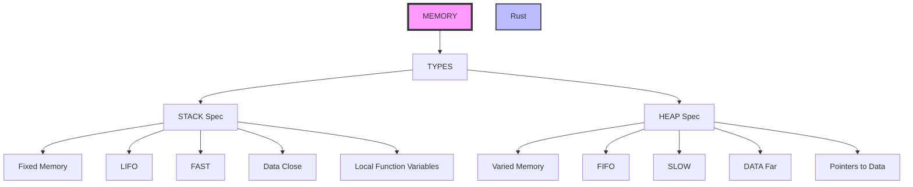

# Introduction:</p>
A journey into Rust. Designed to focus on progress steps and learned lessons.


## Memory:</p>
Two elements STACK and HEAP, most programmers know those two.</p> There are some key features:</p>

### Stack: </p>
Affiliated with Fixed memory data items.</p>

### Heap: </p>
Affiliated with variable memory items sizes.</p>




## Data Types:</p>

They live on either one of the two areas of memory that have been mentioned before. </p>

### String</p>
Extra help from this article:
</p>
https://www.brandons.me/blog/why-rust-strings-seem-hard

### String_slice is &str:</p>
This the best way once can describe the two.</p> symbol '&' and str. </p> Its an immutable reference to a sequence of UTF-8 characters. </p> 

Great reference here:
[Strings/Rust](https://dev.to/alexmercedcoder/in-depth-guide-to-working-with-strings-in-rust-1522) 

The '&str' is stored on 'STACK'.</p>

### Detailed examples:</p>

(Borrow & Strings)[https://dev.to/stevepryde/rust-string-vs-str-1l93]

(Strings and slices)[https://dev.to/alexmercedcoder/in-depth-guide-to-working-with-strings-in-rust-1522]


### Equalising strings</p>
In the example below we can see two strings equalized and how this works.</p>

```
fn main() {
    // 1. &str (borrowed string slice)
    let borrowed_str: &str = "Hello, world!";

    // 2. Convert to owned String using to_owned()
    let owned_string: String = borrowed_str.to_owned();

    // Now you can modify it
    let mut mutable_string = owned_string;
    mutable_string.push_str(".. and more!");
    println!("{}", mutable_string);
}


```
Ref: [link-Thursday/206-03-26](https://doc.rust-lang.org/book/ch04-01-what-is-ownership.html)

[Ref for study : 2026/03/27](https://users.rust-lang.org/t/why-am-i-able-to-mutate-a-string-literal/39778/16)

[Ref on playground](https://play.rust-lang.org/?version=stable&mode=debug&edition=2018&gist=cf4c7bd80f57b8f341f3089f0e1e66d1)

[String vs str](https://dev.to/dsysd_dev/string-vs-str-in-rust-understanding-the-fundamental-differences-for-efficient-programming-4og8)


### Functions:</p>
The storage arrangement of the function components can vary, below is a simple explanation.</p>

In Rust, the answer depends on whether you are talking about the function code itself or function pointers and closures.</p>

To be precise: functions are not "stored" on the stack or the heap in the way data is.
1. The Function Code (Text Segment). </p>

The actual compiled instructions of a function reside in the Text Segment (or Code Segment) of the program's memory. This is a read-only area of memory loaded when the program starts. It is neither the stack nor the heap.</p>

2. Function Pointers (fn) </p>

When you pass a function around as a value using a function pointer (the fn type), the pointer itself is just a memory address. </p>

    On the Stack: If you declare a variable let f = my_function;, the address of my_function is stored on the stack.</p>

    Size: A function pointer is the size of a usize (e.g., 8 bytes on a 64-bit system).</p>

3. Closures</p>

Closures are more complex because they can "capture" variables from their environment. How they are stored depends on their type:</p>
Stack Storage (Default)</p>

By default, Rust creates a unique, anonymous struct for every closure. If you define a closure within a function, that struct is stored on the stack.</p>
Rust</p>
```
let x = 10;
let closure = |y| x + y; // This struct lives on the stack
```
Heap Storage (Boxed)</p>

If you need to return a closure from a function or store it in a way that outlives the current scope, you must "Box" it. This moves the closure's data to the heap.
Rust</p>
```
fn returns_closure() -> Box<dyn Fn(i32) -> i32> {
    let x = 10;
    Box::new(move |y| x + y) // The closure is now on the heap
}
```
### Summary Table: </p>
Entity	Primary Location	Notes
Compiled Code	Text Segment	Read-only; loaded at execution start.
Function Pointer	Stack	Just a usize address pointing to the Text Segment.</p>
Normal Closure	Stack	An anonymous struct containing captured variables.
Boxed Closure	Heap	Used for dynamic dispatch (dyn Fn) or returning closures.</p>

The "Stack Frame" nuance: While the code isn't on the stack, every time a function is called, a</p> new stack frame is created. This frame stores the function's local variables and return address, but it is destroyed as soon as the function returns. </p>


### Structural Organization:</p>

To make the code more distributed , separated by files within same folder,</p>
The use of mod and the name of the separate file was used in the chapter-4-3 example.</p>

```
mod loopmania;
use loopmania::loopmania;
// use loopmania::*;

fn main() {
    println!("loopmania start");
    loopmania();
}

```

### Note: </p>
The 'use' keyword was followed by a more specific indication to what function to use.</p>
One can still use the '*' to include multiple.


### Tuple deconstructor:</p>

In this example below one can see that</p> statement below equalize:</p> 
(s2,len) to calculate_length(s1);

It may be confusing but the calculate_lenght,</p> returns two parameters, so that would be correct.</p>

```
fn main() {
let s1 = String::from("hello");
let (s2, len) = calculate_length(s1);
println!("The length of '{s2}' is {len}.");
}

fn calculate_length(s: String) -> (String, usize) {
let length = s.len(); // len() returns the length of a String
(s, length)
}
```
This can be a way of getting around the rust ownership model, as string one which was owned by main or within the function that declared it 1st. It now has passed its context and length to calculate_length.</p>

### Cleaner way:</p>
Perhaps this is better?</p>

```
fn main() {
    let s1 = String::from("hello");
    // We pass a reference (&s1) instead of the whole string
    let len = calculate_length(&s1); 
    
    println!("The length of '{s1}' is {len}.");
}

fn calculate_length(s: &String) -> usize {
    s.len()
}

```

### Ownership:</p>

One of the most important aspects of Rust, every thing must by owned by some one only. </p>
Here below, one can see that the person structure was obtaining a value initially, then it passed the ownership to the save_person, the latter saved the value to the database. </p>

If one wants or needs to call the value of  the structure, an error would be encounterred. To correct or provide an alternative one can create a return value in the save_person fn, this would lead to the ability to re-assign the person structure value to person two. </p> Thus facilitating to it to be used within the println! macro.</p>

```
fn struct_handle() {

    let person = get_person();
    let person2 = save_person(person);
    println!("Name= {}", person2.name);
}

fn save_person(person: Person){

    DB::write(person);
    return person;
}
fn get_person (name:String) -> person {

    println!("Please input person name");
    person {
        name: stdin.read_line().unwrap(),
        job: "Software Engineer".to_string(),
    }

}

### Heap and Stack:</p>
Any thing with unknown length will go to heap, Box will always reside on heap segment..</P>

### Clone: </p>
Can be different things to different objects, one must read about what it will to the specific object in question.</p>

#### Reference to topic list:
[Multimple Rust topics with diagrams](https://www.youtube.com/watch?v=zfb1y8yn8QI)

### Async Rust:</p>
[Async-Chnges](https://emschwartz.me/async-rust-can-be-a-pleasure-to-work-with-without-send-sync-static/)

## USIZE:</P>

Reason,Explanation
Portability,"Using u64 for an index on a 32-bit machine would be inefficient (and potentially impossible to map to memory). Using u32 on a 64-bit machine would limit your collections to roughly 4GB, even if you have 32GB of RAM."
Type Safety,Rust is very strict about types. You cannot use a u32 to index a vector without explicitly casting it (as usize). This prevents accidental logic errors when moving code between different CPU architectures.

In Rust, `usize` is the pointer-sized unsigned integer type. Its size is not fixed; instead, it depends on the architecture of the computer your code is running on. 

If you are on a 64-bit system, `usize` is 64 bits wide. On a 32-bit system, it is 32 bits wide. This flexibility is what makes it essential for memory-related operations.

---

## 1. Indexing Collections
The most common use for `usize` is indexing into arrays, vectors, and other collections. Rust requires `usize` for indexing to ensure that the index can theoretically address any memory location available on the specific hardware.

```rust
let fruits = vec!["apple", "banana", "cherry"];
let index: usize = 1; 

// This works because index is usize
println!("{}", fruits[index]); 
```

## 2. Representing Sizes and Lengths
Any function that returns the size of an object or the number of elements in a container will return a `usize`. This includes:
* `.len()` on strings and vectors.
* `std::mem::size_of::<T>()`, which tells you how many bytes a type occupies in memory.


## 3. Pointer Arithmetic and Offsets
Because `usize` is guaranteed to be big enough to hold the memory address of any location on the target architecutre, it is used when performing low-level memory operations. If you are working with raw pointers or calculating offsets in memory, `usize` is the standard unit.

---

## Why not just use `u32` or `u64`?

You might wonder why we don't just use a standard 64-bit integer everywhere. There are two main reasons:

| Reason | Explanation |
| :--- | :--- |
| **Portability** | Using `u64` for an index on a 32-bit machine would be inefficient (and potentially impossible to map to memory). Using `u32` on a 64-bit machine would limit your collections to roughly 4GB, even if you have 32GB of RAM. |
| **Type Safety** | Rust is very strict about types. You cannot use a `u32` to index a vector without explicitly casting it (`as usize`). This prevents accidental logic errors when moving code between different CPU architectures. |

---

> **Note:** While `usize` is great for memory and indexing, it shouldn't be used for general-purpose math (like calculating a user's age or a high score) unless that value is directly tied to the size of data in memory. For general math, `i32` or `u64` are usually better choices because their sizes are predictable across all platforms.

### chapter-4-3 / experimenter01.rs:</p>

There is an interesting set of changes that look into values being passed from a vector. 

Reviewing `experimenter01.rs` now to identify the vector return issue and suggest the correct fix.

Read [](file:///home/devops/Documents/source-code/rst-2026/chapter-4-3/src/experimenter01.rs)

I found the compile errors and the function call mismatch. Now I’m correcting the function so it accepts `vec01`, iterates by index, prints each value, and returns the collected results.

Replacing 19 lines with 18 lines in [](file:///home/devops/Documents/source-code/rst-2026/chapter-4-3/src/experimenter01.rs)


```

```
I’ve updated the file and am verifying it compiles cleanly.

Ran terminal command:  cd /home/devops/Documents/source-code/rst-2026/chapter-4-3/src && rustc experimenter01.rs -o /tmp/experimenter01_test && /tmp/experimenter01_test

## Fix applied

The code in experimenter01.rs is now corrected to:

- accept `vec01` by reference
- iterate through each position with `enumerate()`
- print each item and its index
- return the values as a `Vec<String>`

## Result

The program now outputs:

- `position 0 = Toyota`
- `position 1 = Mitsubishi`
- `position 2 = Mazda`

and returns:

- `["Toyota", "Mitsubishi", "Mazda"]`

If you want the function to return the original types instead of `String`, You can adjust it to return `Vec<&T>` instead.


Example:

```
fn experimenter01(vec01: &Vec<&str>) -> Vec<&str> {
    for (i, &item) in vec01.iter().enumerate() {
        println!("position {} = {}", i, item);
    }
    vec01.clone()  // Returns a copy of the vector with &str elements
}

```

## More on slices:</p>

s.as_bytes() returns a byte slice (&[u8]) where each byte represents part of the UTF-8 encoded string.

The key distinction:

ASCII characters (a-z, 0-9, etc.) = 1 byte each
Unicode characters (emoji, accented letters, etc.) = 2-4 bytes each

```
let s = "Hello";
let bytes = s.as_bytes();
// bytes = [72, 101, 108, 108, 111]  ← each ASCII char is 1 byte

let s = "Café";
let bytes = s.as_bytes();
// bytes = [67, 97, 102, 233]  ← 'é' takes 2 bytes! 
// NOT [67, 97, 102, 233] as separate chars

```

So it's not "one byte per character"—it's one byte per byte of UTF-8 encoding. Most characters you type are 1 byte, but accented letters, emojis, and other Unicode characters use multiple bytes.

If you want the actual character count, use s.len() (returns byte length) vs s.chars().count() (returns character count):


```
let s = "Hello World";
let by = s.as_bytes();
for (i, &item) in by.iter().enumerate() {
    println!("Index: {}, Byte: {}, Char: {}", i, item, item as char);
}
// Output:
// Index: 0, Byte: 72, Char: H
// Index: 1, Byte: 101, Char: e
// ...
// Index: 5, Byte: 32, Char:   (space found, returns 5)

```

This example:

```

for (i, &item) in by.iter().enumerate() {
    if item == b' ' {  // b' ' is a space byte (32)
        return i;
    }
}

```
1. What i refers to:

i is the index (position) of each element
Starts at 0 and increments: 0, 1, 2, 3, etc.
In this context: if space is at position 5, i would be 5
2. What &item refers to:

&item is a reference to each individual byte
item (without the &) would be the actual byte value (a u8 number)
The & in the pattern &item dereferences it, so you can use item directly as a number, not as a reference
Each byte is a number: 'H'=72, 'e'=101, 'l'=108, ' '=32
3. What enumerate() does:

Takes an iterator and pairs each element with its index
Converts: [72, 101, 108, 108, 111] → [(0, 72), (1, 101), (2, 108), (3, 108), (4, 111)]
So you get both the position AND the value in one loop
