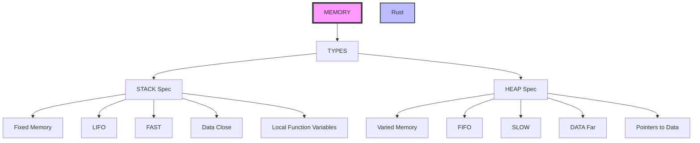

# Introduction:</p>
A journey into Rust. Designed to focus on progress steps and learned lessons.


## Memory:</p>
Two elements STACK and HEAP, most programmers know those two.</p> There are some key features:</p>

### Stack: </p>
Affiliated with Fixed memory data items.</p>

### Heap: </p>
Affiliated with variable memory items sizes.</p>




## Data Types:</p>

They live on either one of the two areas of memory that have been mentioned before. </p>

### String</p>
Extra help from this article:
</p>
https://www.brandons.me/blog/why-rust-strings-seem-hard

### String_slice is &str:</p>
This the best way once can describe the two.</p> symbol '&' and str. </p> Its an immutable reference to a sequence of UTF-8 characters. </p> 

Great reference here:
[Strings/Rust](https://dev.to/alexmercedcoder/in-depth-guide-to-working-with-strings-in-rust-1522) 

The '&str' is stored on 'STACK'.</p>

### Detailed examples:</p>

(Borrow & Strings)[https://dev.to/stevepryde/rust-string-vs-str-1l93]

(Strings and slices)[https://dev.to/alexmercedcoder/in-depth-guide-to-working-with-strings-in-rust-1522]


### Equalising strings</p>
In the example below we can see two strings equalized and how this works.</p>

```
fn main() {
    // 1. &str (borrowed string slice)
    let borrowed_str: &str = "Hello, world!";

    // 2. Convert to owned String using to_owned()
    let owned_string: String = borrowed_str.to_owned();

    // Now you can modify it
    let mut mutable_string = owned_string;
    mutable_string.push_str(".. and more!");
    println!("{}", mutable_string);
}


```
Ref: [link-Thursday/206-03-26](https://doc.rust-lang.org/book/ch04-01-what-is-ownership.html)

[Ref for study : 2026/03/27](https://users.rust-lang.org/t/why-am-i-able-to-mutate-a-string-literal/39778/16)

[Ref on playground](https://play.rust-lang.org/?version=stable&mode=debug&edition=2018&gist=cf4c7bd80f57b8f341f3089f0e1e66d1)