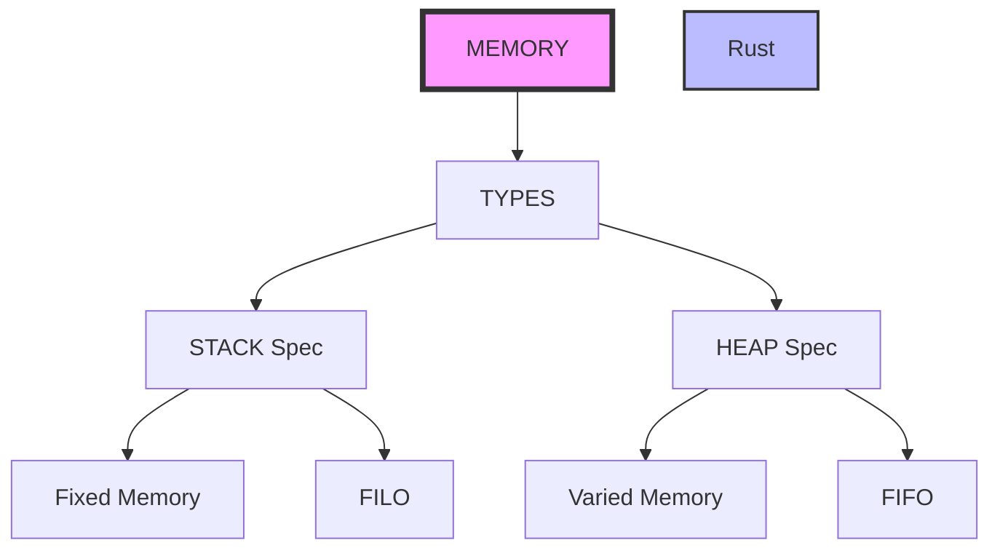

# Introduction:

A journey into Rust. Designed to focus on progress steps and learned lessons.

## Memory:

Two elements STACK and HEAP, most programmers know those two.
 Thre are some key features:

### Stack: 

Afiliated with Fixed memory data items.

### Heap: 

Afiliated with variable memory items sizes.

