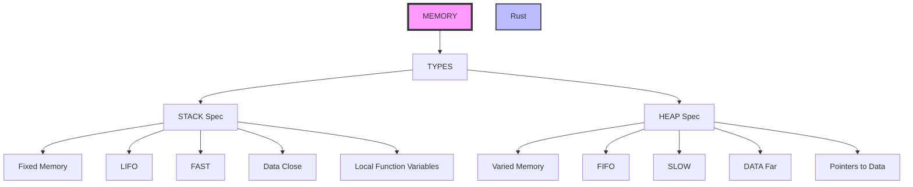

# Introduction:

A journey into Rust. Designed to focus on progress steps and learned lessons.

## Memory:

Two elements STACK and HEAP, most programmers know those two.
 There are some key features:

### Stack: 

Affiliated with Fixed memory data items.

### Heap: 

Affiliated with variable memory items sizes.

## Data Types:

They live on either one of the two areas of memory that have been mentioned before. 

### String

Extra help from this article:

https://www.brandons.me/blog/why-rust-strings-seem-hard