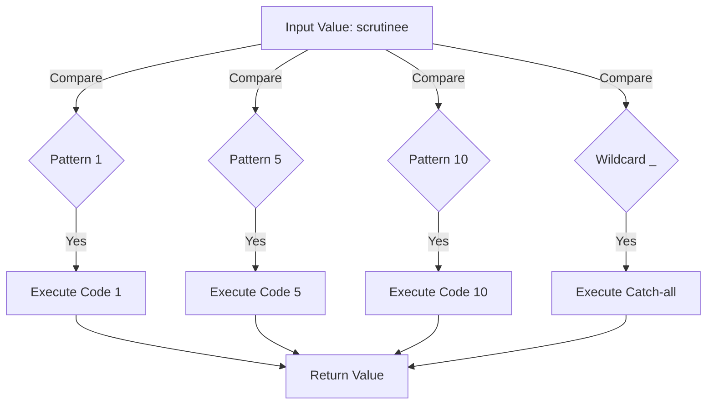

# RST 2026 Project: 

This is rst project 01 progress steps, log, system setup for deployment, (CICD/Devops), Functional programming and ML related aspect for 2026.

## Embedding graphs:</p>
 One of the key components of any project or code related work is how to clearly represent the flow or the idea tha one is thriving to achieve. </p> Here I always prefer the diagrams as a better way to represent a complex idea. </p> This is most likely be in software. Here are the rules to embed mermaid flow chart:</p>

 

## Matching:</p>

One of the interesting consepts of Rust. I didn't come accross this way. From the Rust book I have picket an example which was displayed in test-3-8, in a final itteration. </p>

Best display from a graphical view would be the diagram below:</p>
[link to online test app](https://mermaid.live/edit#pako:eNp10F1LwzAUBuC_Es71Vpr0a8mF4DovvBMRRdchoT1bC_0iS3Da9b-bzXajws5VXvKcJCcdpE2GIGBbNl9pLpUmL6ukJrbu1491azR5laVBQfapMrqoETdkPr87xk3VSoVHsqTdk9QaVU1oP3T-E-wi2A3hXYTjODeM370VZZZKlZFPS_7QklpF3nF_wiSm64cDpkYjie1YhG4GxSaKTRUblTdR3lTZh43Onzj_6qRO87ksy834vJiezWr9jNrY6c5_ORwTs7-9IXmT5I8JZrBTRQZCK4MzqFBV8hShO8kEdI4VJiDsMsOtNKVOIKl729bK-qNpqrFTNWaXg9jKcm-TaTOpcVXInZJXgnWGKm5MrUH40fkIEB0cQDDuuCHz-cLlLAyoF9rdbxA0oI5PFx4POA9d7kVBP4Of862us4gC1xb13YDTMIj6X9ihtp8)



A simple snipet to conclude the idea:</p>

```
match coin {
    Coin::Penny => 1,
    Coin::Nickel => 5,
    Coin::Dime => 10,
    _ => 0, // Catch-all
}
```

## Cargo build options:</p>
An informative link can be found below.</p>
Recommend reading details.</p>
[Cargo Options](https://doc.rust-lang.org/cargo/commands/cargo-build.html_)